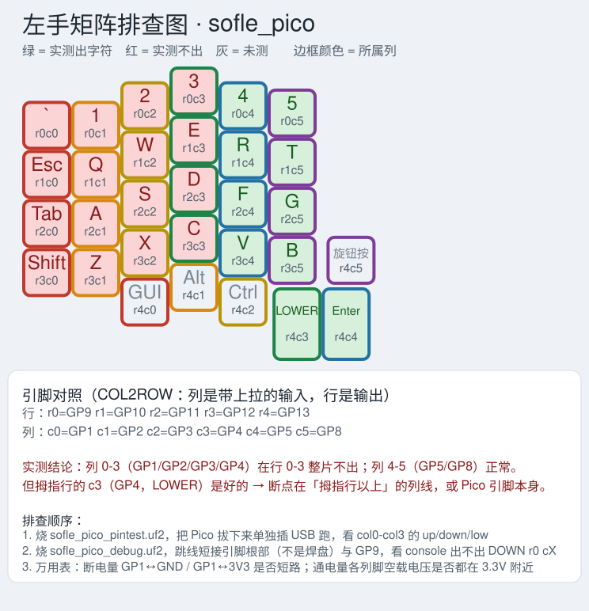
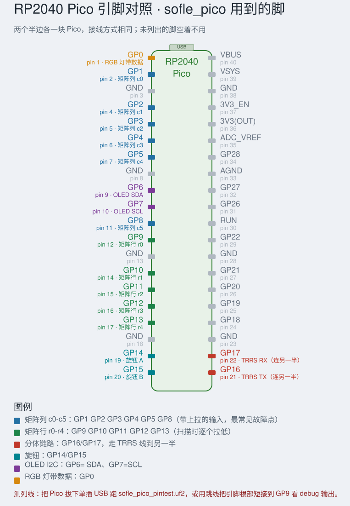

# 左手按键缺失的排查指南（怀疑 Pico / 板子）

症状（已由 `probe` 固件确认）：**左半只有矩阵列 4、5（GP5、GP8）在行 0-3 出键，列 0-3（GP1-GP4）整片不出**，
而拇指行的 GP4（LOWER）是好的、右手完全正常、`MO(1)`/`Enter` 都对。

固件侧已经排除的：`matrix_pins` 与上游 QMK 一致（行 GP9-GP13、列 GP1 GP2 GP3 GP4 GP5 GP8、COL2ROW）、
手性正确、键位正确、EEPROM 已自动重写。所以问题在**引脚 → 走线 → 按键**这条链上。





（上图：哪个键是哪个矩阵位置、哪一列不通；下图：这些引脚在 Pico 的哪个物理位置上，测的时候对着找。）

---

## 第一步：跑引脚自检固件（不用万用表）

烧 [`sofle_pico_pintest.uf2`](sofle_pico_pintest.uf2)（源码 `keyboards/sofle_pico/keymaps/pintest/`），
`qmk console` 看输出，每 5 秒一轮：

```
--- sofle_pico pin test, this half is left ---
col0 GP1   up=1 down=0 low=0  OK
col1 GP2   up=1 down=0 low=0  OK
col2 GP3   up=0 down=0 low=1  BAD: line held low (short to GND, or dead pin)
...
no bridges between matrix pins
```

| 字段 | 含义 | 正常 | 异常说明 |
|---|---|---|---|
| `up` | 内部上拉读回 | 1 | 0 = 这条线被拉低（对 GND 短路 / 引脚坏） |
| `down` | 内部下拉读回 | 0 | 1 = 被拉高（对 3V3 短路） |
| `low` | 拉低后读回 | 0 | 1 = 引脚拉不下去（死脚 / 被强上拉） |
| `BRIDGE` | 一根拉低、其他读回 | 无 | 两根线短在一起（连锡 / 板上短路） |

**关键做法：把 Pico 从键盘上拔下来（插座式的话），只插 USB 单独跑这个固件。**
此时没有任何外部线路能拉这些引脚，剩下的只有引脚本身和它的焊点：

- 单独跑还是 `BAD` → **Pico（或它的排针焊点）有问题**
- 单独跑全 `OK` → Pico 是好的，故障在 PCB 走线 / 排母 / 二极管 / 开关

## 第二步：万用表交叉验证（Pico 单独）

| 测试 | 方法 | 正常 |
|---|---|---|
| 对 GND / 3V3 短路 | 断电，二极管档量 GP1↔GND、GP1↔3V3 | 一个方向 0.5-0.7V，反向不通；**0Ω = 坏** |
| 空载电平 | 只插 USB（跑默认固件），直流档量 GP1-GP5、GP8 对 GND | 列脚是带上拉的输入，都应 ~3.3V；某个脚 0V 或中间值 = 该脚异常 |
| 引脚驱动能力 | 用 `pintest` 的 `low=` 结果替代 | `low=0` |

（`pintest` 运行时会短暂改动引脚电平，量电压时换回默认固件或 `probe` 更准。）

## 第二步半：断点二分定位（列线不通时，最实用）

工具：万用表**通断档（蜂鸣）**。前提：**拔掉 USB 和 TRRS**，键盘完全断电，两半分开。

### 1. 先确认"不是短路"（做过了就跳过）

| 测量 | 正常 | 异常 |
|---|---|---|
| GP1 ↔ 3V3 | `OL`（开路） | 蜂鸣/0Ω = 短路到 3V3 |
| GP1 ↔ GND | `OL`；二极管档一个方向 0.5-0.7V 是正常的 ESD 二极管 | 蜂鸣/0Ω = 短路到 GND |
| GP1 ↔ GP2 / GP3 / …（列与列） | `OL` | 蜂鸣 = 列间桥接 |

**`0L` / `OL` 就是开路，说明没短路——这是好消息**，故障不是"被拉死"，而更可能是"某段走线断了"。

### 2. 从引脚往按键量，二分找断点

一个探针固定在 Pico 的 **列脚**（从引脚根部量），另一个探针去碰**同一列每个按键的列侧焊盘**，
从数字行往下（或从拇指行往上）逐个量，记下导通/不通：

| 列 | r0 数字行 | r1 上排 | r2 中排 | r3 下排 | r4 拇指 | 断在哪 |
|---|---|---|---|---|---|---|
| c0 = GP1 | ` | Esc | Tab | Shift | GUI | |
| c1 = GP2 | 1 | Q | A | Z | Alt | |
| c2 = GP3 | 2 | W | S | X | Ctrl | |
| c3 = GP4 | 3 | E | D | C | LOWER | |
| c4 = GP5 | 4 | R | F | V | Enter | |
| c5 = GP8 | 5 | T | G | B | 旋钮按 | |

**最后一个导通、第一个不导通的中间，就是断点。** 常见原因：过孔裂、焊盘被顶掉、排母接触不良、
二极管或热插拔座虚焊。

### 3. 怎么认"列侧焊盘"

从 Pico 的列脚量到开关的**两个**焊盘：

- 量到 **0Ω（蜂鸣）** 的那个 = 列侧（走线直连）→ 用它做上面的二分
- 另一个会显示 **二极管压降（约 0.5V）或 OL** = 二极管那一侧

（开关不按下时两侧本来就不通，别量成"开关两脚之间"。）

### 4. 顺便做一个"弯折测试"

烧 `sofle_pico_debug.uf2`、开 `qmk console`，一边轻轻**按压/扭动**左半 PCB（尤其 Pico 座、
拇指区、OLED 附近），一边看有没有突然冒出来的 `DOWN rXcY`。断线如果是裂痕，弯折时会出现断续事件——
这能直接指出裂痕位置。

## 第二步半之二：锡膏残留 / 没完全回流（用过锡膏的话必看）

锡膏残留分三种，影响完全不同：

| 情况 | 现象 | 怎么办 |
|---|---|---|
| **锡膏没完全熔化**（最像你现在的情况） | 焊点看着"焊上了"，其实是虚的/不导电 → **整片键干净地没反应** | 补助焊剂 + 少量新锡，用烙铁重新熔化一次 |
| **锡珠 / 飞溅** | 真的短路 → 自动冒键（phantom）、按键错乱、整列"常按" | 清掉锡珠 / 吸锡带处理 |
| **单纯助焊剂残留** | 免清洗型的绝缘电阻通常 >10MΩ，基本无害；**水溶性/含活性剂的残留是离子性的，会导电、会腐蚀**，还会吸潮 | 清洗干净 |

判据：**你的现象是"整列静默 + GP1↔3V3 开路(OL)"，这是开路特征，不是短路特征** →
最可能是"没焊上/虚焊"，而锡膏没回流正好造成这个。

**看焊点外观**：正常回流焊点是**光亮、内凹**的；没熔透的锡膏是**灰暗、粗糙、颗粒感/球状**的。
用放大镜/手机微距看 Pico 排针、二极管、过孔，灰暗粗糙的那些就是嫌疑点。

### 清洗（做完再复测，残留会让万用表读数骗人）

1. 拔掉 USB 和 TRRS，完全断电
2. 99% 异丙醇（IPA）+ 防静电刷/无尘布，重点刷：Pico 排针根部、二极管、过孔、热插拔座周围
3. 顽固松香可以用专用洗板水；**千万别用含水的酒精棉片**，也别让液体进入 OLED 排线座
4. 用无尘布吸干 + 气吹，**等完全干燥（几分钟）再上电**（OLED 面板不要泡）
5. 清洗前后各做一次"带电碰 GND"二分测试：
   - 清洗/补焊后列恢复 → 就是残留或虚焊
   - 还是不通 → 真断线，继续用下面的通断二分

### 重新回流可疑焊点

助焊剂 + 少量新锡，烙铁 330-350°C，每个脚停 1-2 秒（不要超过 3 秒）。
Pico 的 **GP1 / GP2 / GP3 / GP4 / GP8** 和这些列上按键的二极管优先补一遍。

## 第三步：区分"芯片坏"还是"焊点坏"

- **插座式 Pico**：拔下来单测 → 单测坏 = Pico 问题；单测好但装上去坏 = 排母接触 / 焊点
- **焊死的**：用 `debug` 固件 + `qmk console`，拿跳线把 Pico 的**引脚根部**（不是 PCB 焊盘）短接到 GP9：
  - 引脚根部能出 `DOWN r0 cX`、焊盘上不出 → 焊点虚焊
  - 引脚根部也不出 → 引脚本身坏
- 补焊：GP1 / GP2 / GP3 / GP4 / GP8 重新上锡（助焊剂 + 350°C，2 秒内），排针根部尤其注意

## 第四步：换 Pico 时注意

- 本固件是按 **RP2040** 编的（`keyboard.json` 里 `"processor": "RP2040"`）。换 **Pico 2（RP2350）**
  不能直接烧这个 uf2，需要按 RP2350 重新编（对应平台支持也要跟着换）。
- 最省事的验证：**把两半的 Pico 对调**。故障跟着 Pico 走 = Pico 问题；故障留在左板 = 板子问题。

## 第五步：别漏掉"看起来像 Pico 坏"的情况

- **供电**：劣质 USB 线 / 同一 USB 口带两个 Pico / 长了会掉压 → 先换线换口试
- **3V3 不稳**：量 Pico 的 3V3 脚，应在 3.25-3.35V；掉到 3.0V 以下会随机丢键
- **RST/BOOT 虚焊**、GND 没接好也会表现为随机丢键

---

## 相关文件

| 文件 | 用途 |
|---|---|
| `sofle_pico_pintest.uf2` | 引脚电气自检 + 桥接检查（本轮新增） |
| `sofle_pico_debug.uf2` | 原始矩阵打控制台（`DOWN r2 c4`），可做跳线测试 |
| `sofle_pico_probe.uf2` | 每键唯一字符，快速看哪些键通 |
| `sofle_pico_default*.uf2` | 正常固件（`split-left` / `split-right` 强制手性） |

重新编译：`qmk compile -kb sofle_pico -km pintest`（`probe` / `debug` 同理）。
