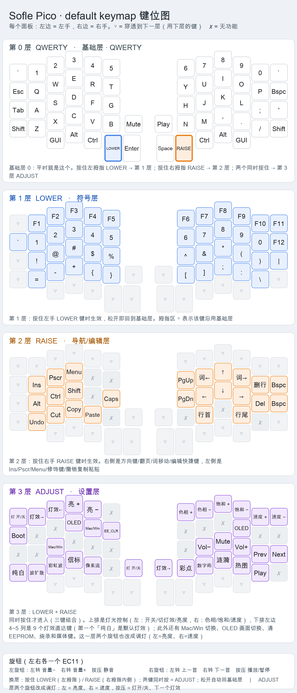

# sofle_pico `default` 键位图与分层说明



> 放大看不糊的矢量版：[keymap_layers.svg](keymap_layers.svg)

> 图片由 `gen_keymap_image.py` 从 `keymap.c` + `keyboard.json` 自动生成，改键后重跑该脚本即可刷新。

## 一、层的切换方式

固件一共 4 层，**只有两个键负责换层，全部在拇指区**：

| 层号 | 层名 | 怎么进入 | 松开后 |
|---|---|---|---|
| 0 | QWERTY | 默认基础层（开机即此层） | — |
| 1 | LOWER | **按住**左手拇指的 `LOWER` 键 | 松开回到基础层 |
| 2 | RAISE | **按住**右手拇指的 `RAISE` 键 | 松开回到基础层 |
| 3 | ADJUST | **同时按住** `LOWER` + `RAISE` | 松开任意一个即退出 |

拇指区的两个换层键位置（看图更直观）：

```
      左手拇指区                     右手拇指区
  GUI  Alt  Ctrl  [LOWER]  Enter | Space  [RAISE]  Ctrl  Alt  GUI
                     ↑                        ↑
              按住 = 第1层              按住 = 第2层
              两个一起按住 = 第3层 ADJUST（三键组合，不会误触）
```

其它切换类按键（都在 ADJUST 层）：

- `OLED`（`OLED_NEXT`，左右各一个）：切换**本侧** OLED 的画面（status / anim / logo）。
- `EE_CLR`：清空 EEPROM。因为 VIA 把键位存在 EEPROM 里，改了 keymap 之后需要清一次才会生效。
- `Mac/Win`（`CG_TOGG`）：切换 Mac 与 Win/Linux 模式，影响修饰键顺序以及 RAISE 层的行首/行尾/词移动等快捷键，选择同样存 EEPROM。
- `Boot`（`QK_BOOT`）：进入 bootloader 准备烧录；按住 Pico 的 BOOT 键插 USB 也可以。

## 二、每层的键位

每层给两张表：**左手**从最左列到最右列；**右手**按从内到外（靠近中间缝 → 最外侧）排列。手指的实际位置看上面的图更直观。

### 第 0 层 · QWERTY — 基础层（默认）

开机就是这一层，普通打字用。

**左手**

| | 1 | 2 | 3 | 4 | 5 | 6 |
|---|---|---|---|---|---|---|
| 数字行 | ` | 1 | 2 | 3 | 4 | 5 |
| 上排 | Esc | Q | W | E | R | T |
| 中排 | Tab | A | S | D | F | G |
| 下排 | Shift | Z | X | C | V | B |
| 拇指/旋钮 | GUI | Alt | Ctrl | LOWER | Enter | Mute |

**右手**

| | 1 | 2 | 3 | 4 | 5 | 6 |
|---|---|---|---|---|---|---|
| 数字行 | 6 | 7 | 8 | 9 | 0 | ` |
| 上排 | Y | U | I | O | P | Bspc |
| 中排 | H | J | K | L | ; | ' |
| 下排 | N | M | , | . | / | Shift |
| 拇指/旋钮 | Play | Space | RAISE | Ctrl | Alt | GUI |

### 第 1 层 · LOWER — 数字/符号层

符号、F1–F12、方向键等；按住左手 LOWER 进入。

**左手**

| | 1 | 2 | 3 | 4 | 5 | 6 |
|---|---|---|---|---|---|---|
| 数字行 | ▽ | F1 | F2 | F3 | F4 | F5 |
| 上排 | ` | 1 | 2 | 3 | 4 | 5 |
| 中排 | ▽ | ! | @ | # | $ | % |
| 下排 | ▽ | = | - | + | { | } |
| 拇指/旋钮 | ▽ | ▽ | ▽ | ▽ | ▽ | ▽ |

**右手**

| | 1 | 2 | 3 | 4 | 5 | 6 |
|---|---|---|---|---|---|---|
| 数字行 | F6 | F7 | F8 | F9 | F10 | F11 |
| 上排 | 6 | 7 | 8 | 9 | 0 | F12 |
| 中排 | ^ | & | * | ( | ) | | |
| 下排 | [ | ] | ; | : | \ | ▽ |
| 拇指/旋钮 | ▽ | ▽ | ▽ | ▽ | ▽ | ▽ |

### 第 2 层 · RAISE — 导航/编辑层

方向、翻页、词移动、撤销/复制/粘贴；按住右手 RAISE 进入。

**左手**

| | 1 | 2 | 3 | 4 | 5 | 6 |
|---|---|---|---|---|---|---|
| 数字行 | ▽ | ▽ | ▽ | ▽ | ▽ | ▽ |
| 上排 | ▽ | Ins | Pscr | Menu | ✗ | ✗ |
| 中排 | ▽ | Alt | Ctrl | Shift | ✗ | Caps |
| 下排 | ▽ | Undo | Cut | Copy | Paste | ✗ |
| 拇指/旋钮 | ▽ | ▽ | ▽ | ▽ | ▽ | ▽ |

**右手**

| | 1 | 2 | 3 | 4 | 5 | 6 |
|---|---|---|---|---|---|---|
| 数字行 | ▽ | ▽ | ▽ | ▽ | ▽ | ▽ |
| 上排 | PgUp | 词← | ↑ | 词→ | 删行 | Bspc |
| 中排 | PgDn | ← | ↓ | → | Del | Bspc |
| 下排 | ✗ | 行首 | ✗ | 行尾 | ✗ | ▽ |
| 拇指/旋钮 | ▽ | ▽ | ▽ | ▽ | ▽ | ▽ |

### 第 3 层 · ADJUST — 设置层

灯光控制（开关/切换/色相/饱和/亮度/速度 + 9 个灯效直达，含默认的纯白常亮）、模式切换、OLED 画面切换、清 EEPROM、烧录、媒体键；LOWER+RAISE 同时按住进入。

**左手**

| | 1 | 2 | 3 | 4 | 5 | 6 |
|---|---|---|---|---|---|---|
| 数字行 | 灯 开/关 | 灯效→ | 灯效← | 亮 + | 亮 − | ✗ |
| 上排 | Boot | ✗ | ✗ | OLED | Mac/Win | EE_CLR |
| 中排 | ✗ | ✗ | Mac/Win | ✗ | ✗ | ✗ |
| 下排 | 纯白 | 波扩散 | 彩虹波 | 信标 | 像素流 | ✗ |
| 拇指/旋钮 | ▽ | ▽ | ▽ | ▽ | ▽ | 灯 开/关 |

**右手**

| | 1 | 2 | 3 | 4 | 5 | 6 |
|---|---|---|---|---|---|---|
| 数字行 | 色相 + | 色相 − | 饱和 + | 饱和 − | 速度 + | 速度 − |
| 上排 | ✗ | ✗ | ✗ | OLED | ✗ | ✗ |
| 中排 | ✗ | Vol− | Mute | Vol+ | Prev | Next |
| 下排 | 彩点 | 数字雨 | 涟漪 | 热图 | Play | ✗ |
| 拇指/旋钮 | 灯效→ | ▽ | ▽ | ▽ | ▽ | ▽ |

表内符号：`▽` = 穿透（沿用下一层的键），`✗` = 无功能。

## 三、旋钮

| 旋钮 | 左转（逆时针） | 右转（顺时针） | 按压 |
|---|---|---|---|
| 左手 EC11 | 音量 − | 音量 + | 静音 `Mute` |
| 右手 EC11 | 上一首 `Prev` | 下一首 `Next` | 播放/暂停 `Play` |

两个旋钮在 QWERTY / LOWER / RAISE 上都可用（上层写 `▽` 穿透到基础层的定义）。

**ADJUST 层是例外**：这一层旋钮临时改成调灯——左旋钮 `亮 −/亮 +`、右旋钮 `速度 −/速度 +`，按压键也在这一层变成 `灯 开/关`（左）和 `灯效→`（右）。松开换层键就回到音量 / 切歌。

## 四、自定义键说明

| 键位显示 | 键码 | 作用 |
|---|---|---|
| `LOWER` / `RAISE` | `MO(_LOWER)` / `MO(_RAISE)` | 按住临时切层 |
| `OLED` | `OLED_NEXT` | 切换本侧 OLED 的画面（status → anim → logo → status） |
| `EE_CLR` | `EE_CLR` | 清空 EEPROM（VIA 键位存 EEPROM，改键后需要清） |
| `Mac/Win` | `CG_TOGG` | 切换 Mac / Win 模式 |
| `词←` / `词→` | `KC_PRVWD` / `KC_NXTWD` | 按模式发送 Ctrl+←/→ 或 Alt+←/→（按词移动） |
| `行首` / `行尾` | `KC_LSTRT` / `KC_LEND` | Home/End；Mac 模式下发 Cmd+←/→ |
| `删行` | `KC_DLINE` | Ctrl+Backspace（删到行首） |
| `Undo` `Cut` `Copy` `Paste` | `KC_UNDO` … | 按模式发送 Ctrl 或 Cmd 组合键 |
| `Boot` | `QK_BOOT` | 进入 bootloader |

## 五、ADJUST 层的灯光键

逐键 RGB（左右各 29 颗，共 58 颗）的控制全在 ADJUST 层上，左右手各一组：

| 键位显示 | 键码 | 作用 |
|---|---|---|
| `灯 开/关` | `RM_TOGG` | 灯光总开关（ADJUST 层左旋钮**按下**也是它） |
| `灯效→` `灯效←` | `RM_NEXT` / `RM_PREV` | 在 41 种已启用灯效里前后翻（右旋钮**按下** = 下一个） |
| `纯白` | `FX_WHITE` | 纯白常亮（**出厂默认**）：饱和归零 + 切到 `solid_color`，亮度沿用当前的 |
| `亮 +` `亮 −` | `RM_VALU` / `RM_VALD` | 亮度（0–127，`RGB_MATRIX_MAXIMUM_BRIGHTNESS`） |
| `色相 +` `色相 −` | `RM_HUEU` / `RM_HUED` | 色相 |
| `饱和 +` `饱和 −` | `RM_SATU` / `RM_SATD` | 饱和度 |
| `速度 +` `速度 −` | `RM_SPDU` / `RM_SPDD` | 灯效速度 |
| `波扩散` `彩虹波` `信标` `像素流` `彩点` `数字雨` `涟漪` `热图` | `FX_*` | 另外 8 个灯效直达键（ADJUST 层下排最左边 4~5 列，左 5 右 4），按一下直接切过去 |

8 个直达灯效的逐帧动画见 `index.html` 的「LED 灯效」一节（数据是用真实灯效源码重放出来的）。直达键只改 RAM 里的灯效模式，重启后回到 EEPROM 里的设置。
